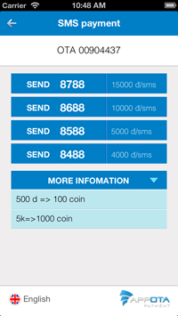

Other languages: [Vietnamese](README.md) | [Chinese](README_CN.md)

**Get Started**

Appota Payment SDK for iOS is the simplest way to integrate payment for
your application on Appota system. This SDK provides solutions for
payment methods such as: SMS, Card, Internet Banking, Paypal and Apple
Payment.

**Steps to integrate SDK:**

​1. Setup Appota SDK

​2. Config SDK

​3. Integrate SDK

 

**1. Setup Appota SDK**

**Import Appota.framework into project**

Drag and drop AppotaSDK.framework and AppotaBundle.bundle into your project.

Tick on checkbox: “Copy items into destination group's folder (if needed)”.
 
In Project app’s target settings section, find [Build phases] and open
Link Binary with Libraries. Click on ‘+’ button and add these frameworks:

```
SystemConfiguration.framework, Security.framework, CFNetwork.framework, QuaztCore.framework,
MessageUI.framework, StoreKit.framework, AudioToolbox.framework, MobileCoreServices.framework,
AVFoundation.framework, OpenGLES.framework, CoreVideo.framework, libxml2.dylib, CoreMedia.framework,
AdSupport.framework, libsqlite3.dylib
```


In project build settings section, find Other Linker Flags, add two values: -ObjC và -all\_load.


Import headers into source files:
In source file you need to use Appota SDK Library, import:

``` objective-c
#import <AppotaSDK/AppotaSDK.h>
```

**Config plist with CLIENT_KEY**

Add 1 string AppotaClientId with the value is CLIENT_ID (details about
CLIENT_ID are in section of getting ACCESS_TOKEN)
Add more schema: Add 1 string URL Array types. Creat 1 item more with
URL Schemes is appotaCLIENT_ID.

For example: If CLIENT_ID = b804d6421df6ae7dbcd51469e4d8ee0005101f540,
schemes will be appotab804d6421df6ae7dbcd51469e4d8ee0005101f540.


**2. Config SDK**

** Config AppotaAPI**

Functions of AppotaSDK used via AppotaPayment. You can call AppotaPayment via [AppotaPayment shareAPI].\

Before using SDK to call functions setting up CLIENT_ID, CLIENT_SECRET, INAPP_ID (just call only one time):

For application in sandbox status:

``` objective-c
AppotaPayment *appotaPayment = [AppotaPayment shareAPI];
appotaPayment.isSandBoxMode = YES;
appotaPayment.clientID = SAND_BOX_CLIENT_ID;
appotaPayment.clientSecret = SAND_BOX_CLIENT_SECRET;
appotaPayment.inappKey = SAND_BOX_INAPP_API_KEY;
appotaPayment.sandboxKey = SAND_BOX_KEY;
```

For application in publish status:

``` objective-c
AppotaPayment *appotaPayment = [AppotaPayment shareAPI];
appotaPayment.clientID = CLIENT_ID;
appotaPayment.clientSecret = CLIENT_SECRET;
appotaPayment.inappKey = INAPP_API_KEY;
```

Parameters such as CLIENT_KEY, CLIENT_SECRET, INAPP_API_KEY,
SAND_BOX_CLIENT_ID, SAND_BOX_CLIENT_SECRET, SAND_BOX_INAPP_API_KEY, SAND_BOX_KEY can be seen on
[https://developer.appota.com/manage-content.html](https://developer.appota.com/manage-content.html) (in section of application management).

** Config handleOpenURL**

In AppDelegate of application call function [[Appota shareAPI]
handleOpenURL:url] as follow:

``` objective-c
- (BOOL)application:(UIApplication *)application
openURL:(NSURL *)url
sourceApplication:(NSString *)sourceApplication
annotation:(id)annotation {     
    return [[AppotaAPI shareAPI] handleOpenURL:url];
}
````

In case that you used another SDK setting handleOpenURL function in
AppDelegate (for example FacebookSDK), you can call [[AppotaAPI
shareAPI] handleOpenURL:url] before returning as follow:

``` objective-c
- (BOOL)application:(UIApplication *)application
openURL:(NSURL *)url
sourceApplication:(NSString *)sourceApplication
annotation:(id)annotation {
    [[AppotaAPI shareAPI] handleOpenURL:url];
    return [self.facebookSDKSession handleOpenURL:url];
}
```

**3. Integrate SDK**

Appota Payment SDK provides class [AppotaPayment](AppotaPayment.html)
packaging entire interface of each payment method. To integrate any
payment methods, you just call respective functions given (refer to
AppotaPaymentTest).

**4 - Run SDK Samples**

- Requirement: Xcode 4.6, iOS SDK 6 or more.

- Open AppotaPaymentTest.xcodeproj to run sample.

- Use SDK in example:

All APIs of SDK are called via 1 function, for example:\
 makeSMSPaymentWithAmount

Results returned in block of function via AppotaPaymentHandler (refer to
AppotaPayment.h in SDK). Value of result can be identified via value of
NSDictionary, AppotaPaymentState and NSError are returned via
AppotaPaymentHandler. (States of AppotaPaymentState are referred to 
AppotaPayment.h in SDK)

Dev need to set code to handle results of payment in payment's block,
for example:

``` objective-c
[appotaPayment makeSMSPaymentWithAmount:500 withState:@"" withTarget:@"" withNoticeUrl:@"" 
withCompletionHandler:^(NSDictionary *apiDict, AppotaPaymentState status, NSError *error) {
    // Xử lý kết quả của payment ở đây
    [self handleSMSPaymentResultDict:apiDict withPaymentState:status];
}];
```

   
